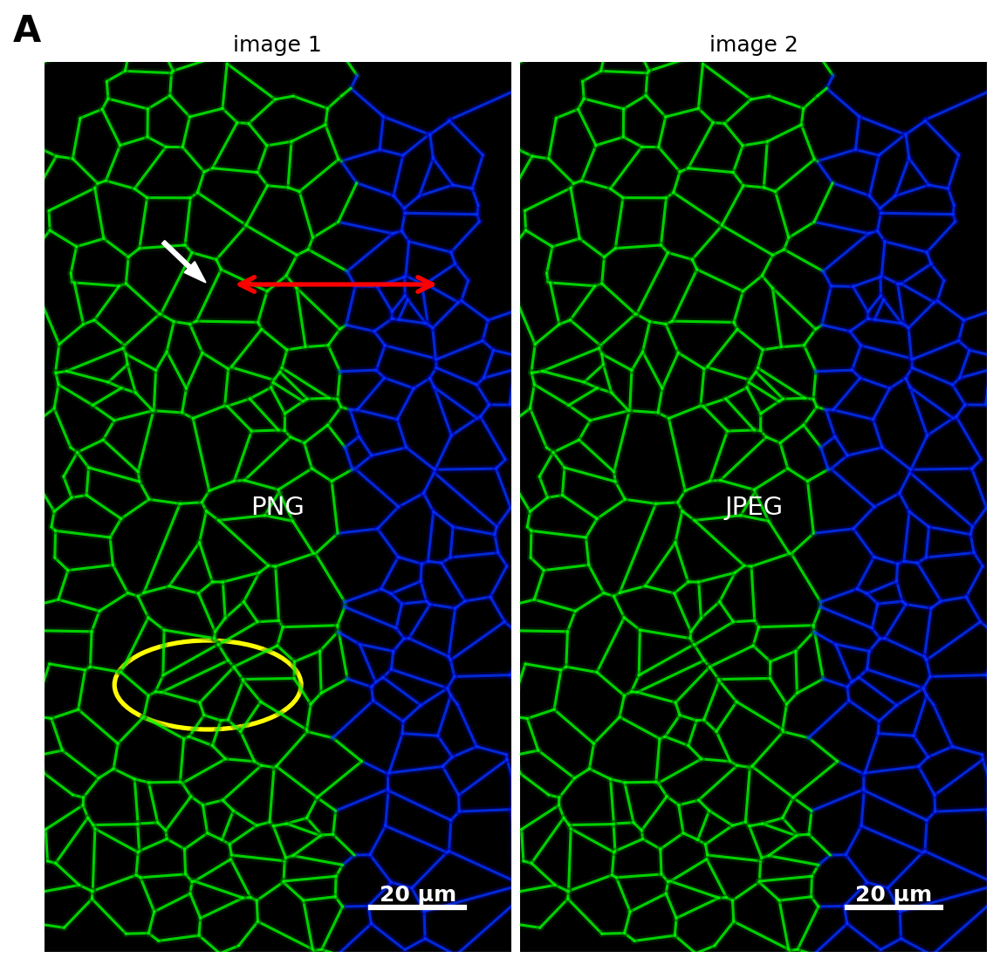
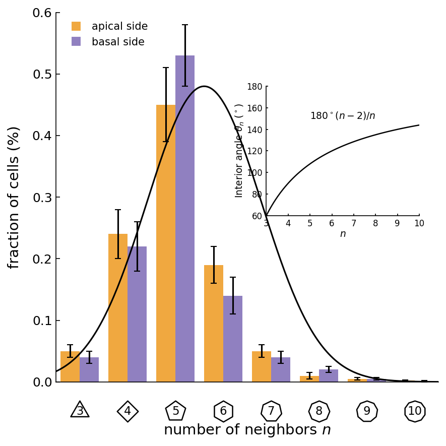
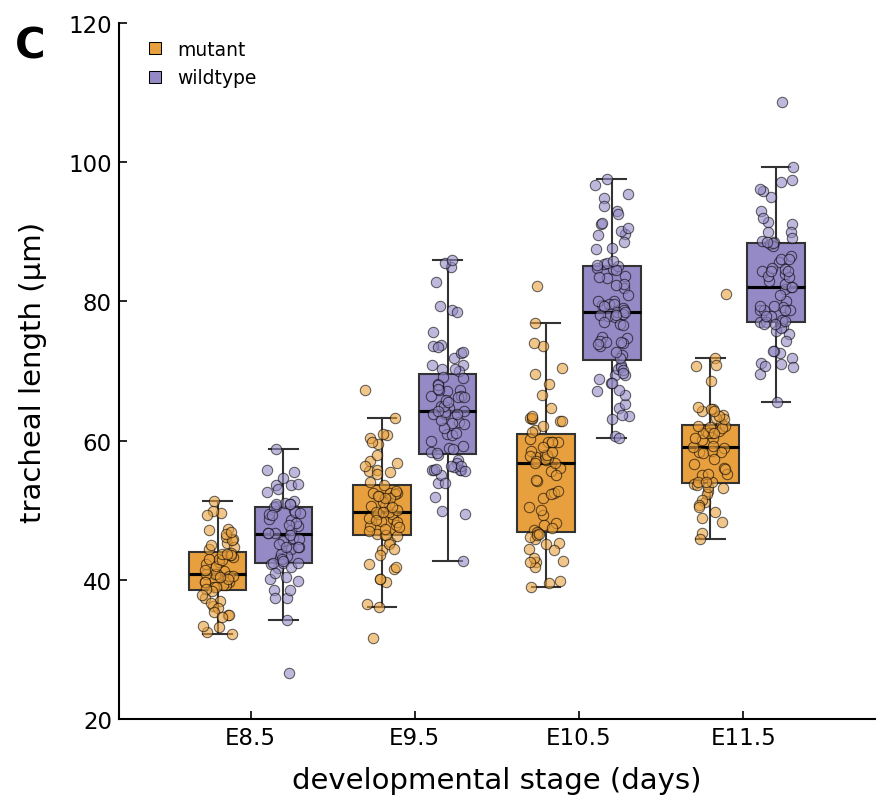
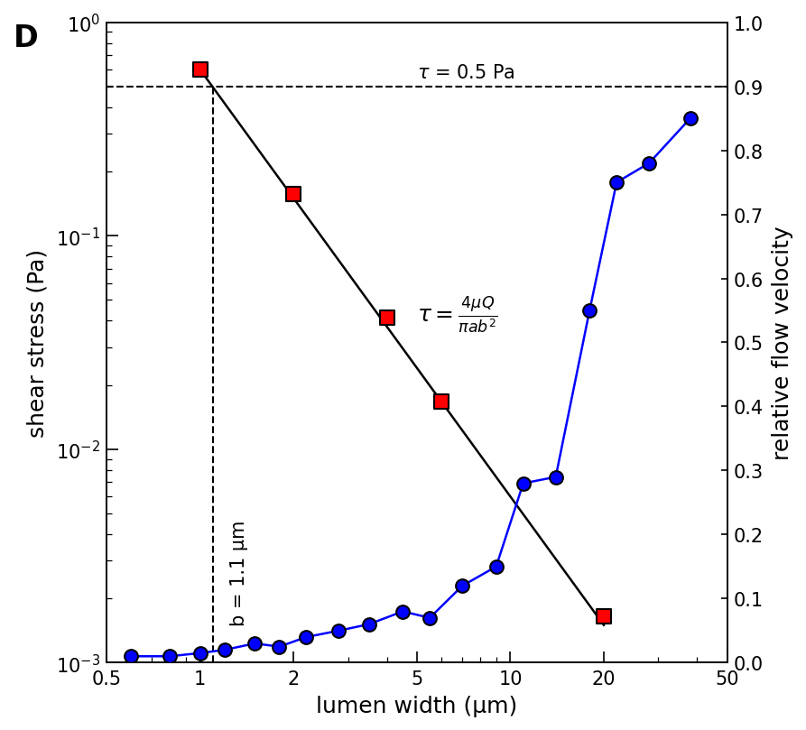
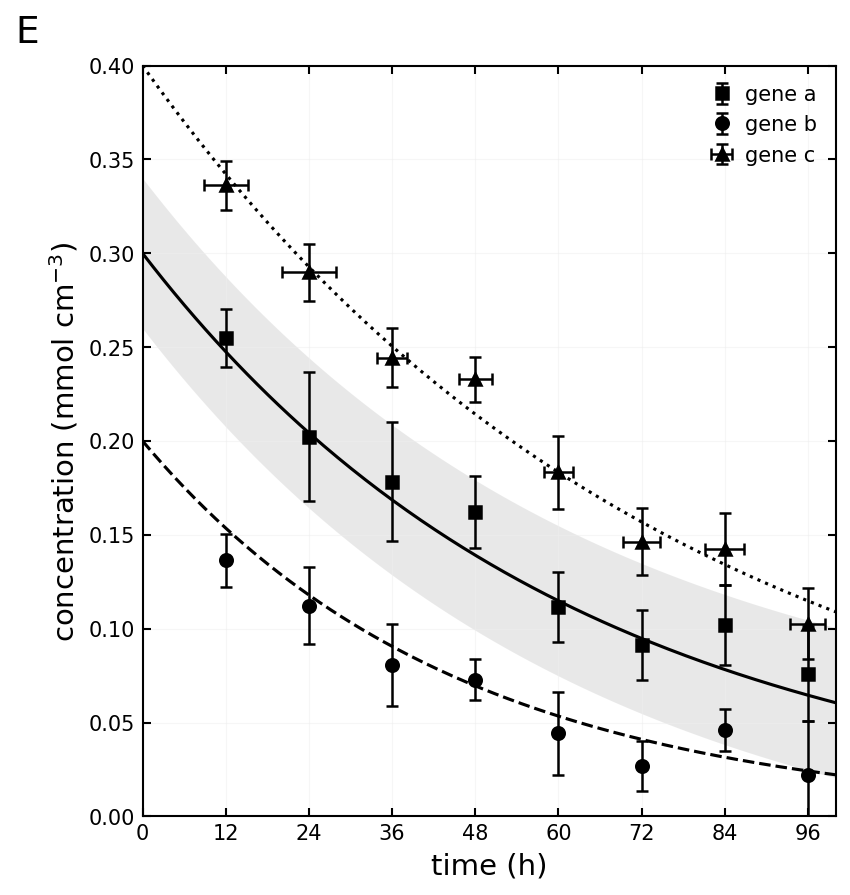
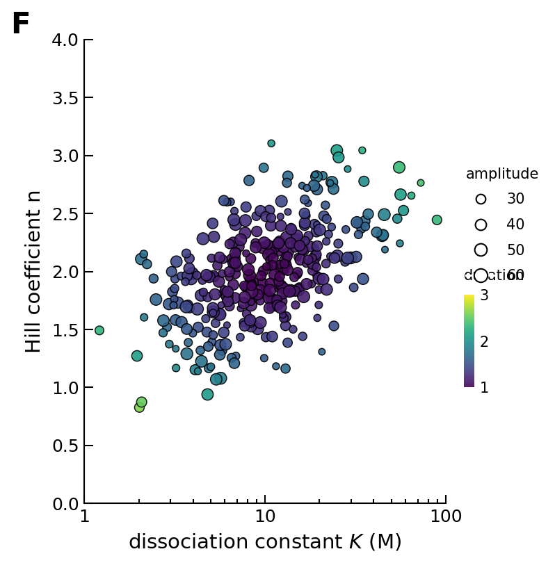

<div align="center">
  
  
  <h1>PlotCouncil</h1>

  <p>
    <strong>Scientific Plot Reproduction with Multi-Agent Review</strong>
  </p>

  <p style="margin: 8px 0;">
    <strong>Back to Chinese:</strong> <a href="README.md">README.md</a>
  </p>
  <p style="margin: 8px 0;">
    <strong>Live toggle version:</strong> <a href="docs/index.html">docs/index.html</a> (bilingual, default Chinese)
  </p>
</div>

<br />

## 📊 Example Results

<div align="center">

### Original Figure


### Reproduced Plots (2×3)

<table>
<tr>
<td><br/><a href="./test/a.py">📝 Code A</a></td>
<td><br/><a href="./test/b.py">📝 Code B</a></td>
<td><br/><a href="./test/c.py">📝 Code C</a></td>
</tr>
<tr>
<td><br/><a href="./test/d.py">📝 Code D</a></td>
<td><br/><a href="./test/e.py">📝 Code E</a></td>
<td><br/><a href="./test/f.py">📝 Code F</a></td>
</tr>
</table>

<p><i>Example figures from <a href="https://github.com/macromeer/scifig_plot_examples_R">macromeer/scifig_plot_examples_R</a></i></p>

</div>

---

## English

> PlotCouncil ingests scientific figures, runs a staged agent loop (Student → Teachers → Chair), and emits high-fidelity Matplotlib code.

* [Features](#features)
* [Usage](#usage)
* [How to install](#how-to-install)
* [FAQ](#faq)
* [Notes](#notes)

---

### Features

* Multi-agent critique: Coder → Style/Layout/Data Reviewers → Chair. Catches layout, color, and data semantic issues.
* Safe rendering: FastAPI renderer executes Matplotlib off the frontend, protecting the UI from heavy compute.
* Local persistence: Project + plot history stored locally via IndexedDB.
* Interactive workflow: Drag/drop images, overlay comparison, auto/manual refinement loops.

---

### Usage

1. Upload: Drag & drop or paste target image (PNG/JPG/WEBP).
2. Select Mode:
   * Simple: Single-pass generation (Fast).
   * Complex: Multi-agent review loop (High Quality).
   * Manual: Custom loop budget for fine-tuning.
3. Run: Click Run. View the live render in the center, code & critiques on the right.
4. Refine: If mismatch occurs, use Refine / Manual Fix or increase loop count.
5. History: Check the drawer for previous snapshots and logs.

---

### How to install

#### Option 1: Docker (Recommended)

Prerequisites: Docker & Docker Compose

```bash
git clone https://github.com/pc9527zxx/PlotCouncil.git
cd PlotCouncil
docker compose up -d
# Access at http://localhost:8032
```

The Docker setup includes: multi-stage build, automatic frontend build and serving, isolated Python env, persistent artifacts, health checks, single port.

#### Option 2: Manual Install

Prerequisites: Node.js ≥ 20, Python ≥ 3.10

**Frontend**

```bash
npm install
npm run build
npm run dev
```

**Renderer**

```bash
cd server
python -m venv .venv
source .venv/bin/activate
pip install -r requirements.txt
uvicorn main:app --reload --port 8032
```

**Configuration**

```bash
# create .env.local in repo root
VITE_RENDER_API_URL=http://localhost:8032/render
# paste Gemini API Key in app Settings (stored in browser only)
```

---

### FAQ

* No reviews appearing? Ensure the API Key is valid and you selected Complex or Full; reviews trigger after the first render.
* Blank plot or error? Check the Logs tab; if blank, switch to Complex so the Data Teacher catches it.
* What to ignore in Git? `.env.local`, `.venv/`, `node_modules/`, `dist/`, `server/artifacts/`.

---

### Notes

* Renderer executes arbitrary Matplotlib code; sandbox if exposed publicly.
* Clean `server/artifacts/` periodically to reclaim disk space.

